<div align="center">

<br/>

# 🔥 Burner Wallet Generator

### Generate. Isolate. Operate. Discard.

A practical toolkit for generating isolated wallets for bots and on-chain operations —
EVM-compatible (BSC, Ethereum, Polygon) and Bitcoin native (SegWit).
Everything runs locally. Nothing leaves your machine.

<br/>

[](https://nodejs.org/)
[](https://docs.ethers.org/)
[](https://bitcoin.org/)
[](LICENSE)

<br/>

> **A compromised bot wallet should never compromise your personal funds.**
> This repo enforces that separation from day one.

<br/>

</div>

---




## 💼 Why this exists

When you run trading bots on-chain, your private key lives in a `.env` file.
If that server gets compromised, everything in that wallet is gone.

The solution is simple: **never use your personal wallet for bots.**

A burner wallet is a fresh, isolated keypair with one job.
You fund it with exactly what the bot needs. Nothing more.
If it gets exposed — you lose the operating capital, not your savings.

---

## 🎯 Who is this for?

| Profile | Use case |
|---------|----------|
| **Bot developers** | Isolated keypair per bot, per environment |
| **DeFi operators** | Separate hot wallet for on-chain interactions |
| **P2P traders** | Fresh Bitcoin address per counterparty |
| **Web3 students** | Learn how wallets actually work under the hood |

---

## ⚡ Generators

| # | Script | Network | Format |
|---|--------|---------|--------|
| 01 | [generate-evm.js](./generate-evm.js) | BSC / Ethereum / Polygon | `0x...` address + private key |
| 02 | [generate-btc.js](./generate-btc.js) | Bitcoin | SegWit `bc1q...` + WIF key |

---

## 🗂️ Structure
```
burnerwallet/
├── generate-evm.js
├── generate-btc.js
├── .gitignore
└── README.md
```
---

## ⚙️ Setup

```bash
git clone https://github.com/HEO-80/burnerwallet.git
cd burnerwallet
npm install
```

---

## 🚀 Usage

### EVM — BSC / Ethereum / Polygon

Used for trading bots, DeFi interactions, smart contract deployment.

```bash
node generate-evm.js
```
Address:      0xAbc123...
Private Key:  0x4f3c...
Mnemonic:     word1 word2 word3 ... word12

Plug directly into your bot's `.env`:

```env
PRIVATE_KEY=4f3c...        # Without the 0x prefix
SNIPER_ADDRESS=0xAbc123...
```

---

### Bitcoin — SegWit Native

Used for P2P purchases (Bisq, HodlHodl) and BTC accumulation wallets.
Compatible with BlueWallet, Trust Wallet, and Electrum.

```bash
node generate-btc.js
```
Bitcoin Address (SegWit):  bc1q...
Private Key (WIF):         KwDi...

Import the WIF key directly into BlueWallet or Trust Wallet.

---

## 🔐 Security

| Risk | Mitigation |
|------|-----------|
| `.env` exposed on server | Burner only holds operating capital — never full savings |
| Seed phrase lost | Write it on paper + engrave on steel plate |
| Key generated online | Run scripts **offline** for significant capital |
| Repo accidentally exposes keys | `.gitignore` excludes `.env` and any output files |

---

## 🗺️ Recommended wallet architecture
Trading bot  ──▶  Burner Wallet (EVM)  ──▶  profits  ──▶  Rabby Wallet
P2P Bitcoin  ──▶  Burner Wallet (BTC)  ──▶  savings  ──▶  BlueWallet / Trust Wallet
Fiat         ──▶  Exchange (Binance)   ──▶  on/off ramp only

One wallet per purpose. One exposure per failure point.

---

## 📖 How it works

**EVM wallets** use `ethers.js` to generate a cryptographically random keypair.
The private key is derived from entropy generated locally — no server involved.

**Bitcoin wallets** use `bitcoinjs-lib` with SegWit P2WPKH format.
SegWit addresses (`bc1q...`) have lower transaction fees than legacy formats.

Neither script transmits anything. Output stays in your terminal.


---

## ⚠️ Read this before you close the terminal

Both wallets are real and functional the moment you generate them.

**EVM wallet (`0x...`)** — works on BSC, Ethereum, Polygon and any EVM-compatible network.
Send BNB, ETH or tokens directly to that address.
Check your balance anytime at [bscscan.com](https://bscscan.com).

**Bitcoin wallet (`bc1q...`)** — a real SegWit Bitcoin wallet.
Import the `Private Key (WIF)` into BlueWallet or Trust Wallet and it appears as a fully functional wallet.
You can receive BTC at that address immediately.

**What to do right now:**
EVM     →  paste the private key into your bot's .env — remove the MetaMask one
Bitcoin →  import the WIF into BlueWallet or Trust Wallet
Both    →  write down the mnemonic / WIF before closing the terminal

---

## 🔑 Where to store your keys

Bitwarden works well for this. Far better than a plain text file on your desktop.

Store this for every wallet you generate:
Name:        Burner EVM - Bot14 - May 2026
Address:     0xAbc123...
Private Key: 0x4f3c...
Mnemonic:    word1 word2 word3 ... word12
Network:     BSC
Purpose:     Bot 14 SniperBot V2

Physical backup still matters — Bitwarden is an online service.
If you lose access to your account, if they shut down, if your email gets hacked — digital backups are gone.
Paper does not depend on anyone.

| Storage | Use case |
|---------|----------|
| Bitwarden | Day-to-day quick access |
| Paper / steel plate | Backup when everything digital fails |

> For bot wallets with small capital (0.01–0.05 BNB), Bitwarden alone is enough.
> For serious amounts — paper backup is mandatory, no exceptions.
---


## 🧰 Tech Stack

<div align="center">


</div>

---

## 👤 Author

**Héctor Oviedo** — Full Stack Developer & DeFi Researcher

[](https://github.com/HEO-80)
[](https://linkedin.com/in/hectorob)

---

## 📄 License

MIT — generate freely, never share your keys.

[](LICENSE)

---

<div align="center">

*One wallet per purpose. One exposure per failure point.*

</div>